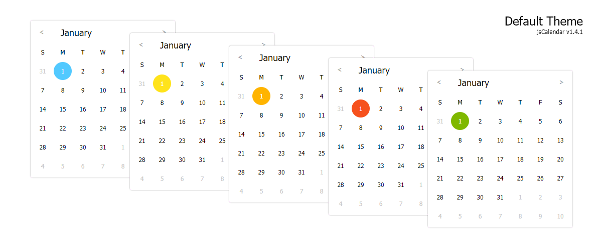
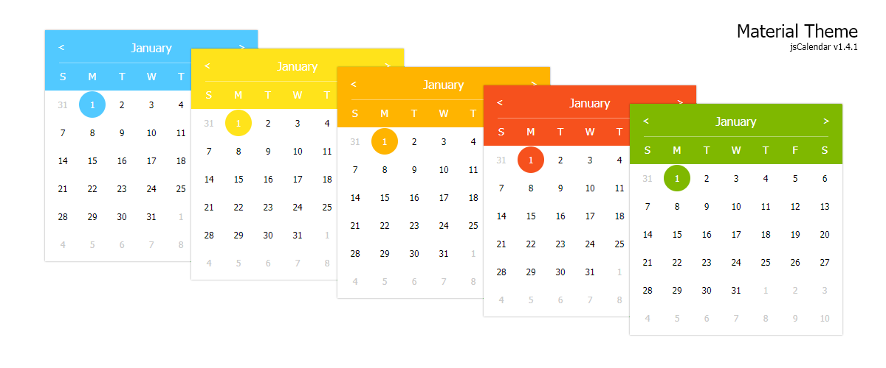
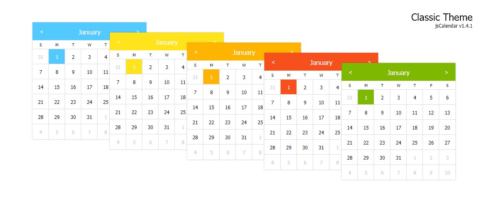
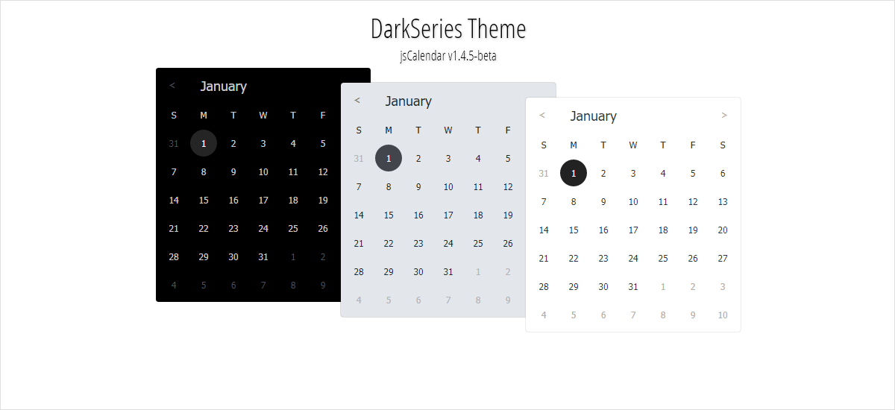
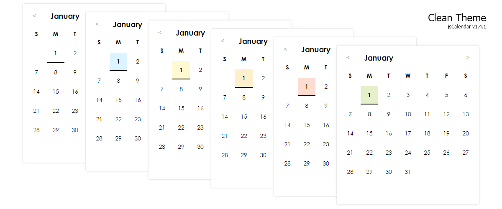

[](https://github.com/GramThanos/jsCalendar/releases/latest)
[](https://github.com/GramThanos/jsCalendar#whats-new)

# jsCalendar
Just a simple javascript calendar

 • [Download](https://github.com/GramThanos/jsCalendar/releases/download/v1.4/jsCalendar_v1.4.zip) • [Live preview](https://gramthanos.github.io/jsCalendar/) • [Documentation](https://gramthanos.github.io/jsCalendar/docs.html) • [Languages](https://gramthanos.github.io/jsCalendar/docs.html#parameter-language) • 


___


### Fast set up

Add the jsCalendar code on `<head>`

```html
<link rel="stylesheet" type="text/css" href="jsCalendar.css">
<script type="text/javascript" src="jsCalendar.js"></script>
```

Then insert a calendar on `<body>`

```html
<div class="auto-jsCalendar"></div>
```

Or maybe you need to display it in an **other language**!

```html
<!-- Load Greek language -->
<script type="text/javascript" src="jsCalendar.lang.gr.js"></script>

<!-- Display calendar in Greek -->
<div class="auto-jsCalendar" data-language="gr"></div>
```

___


### Learn to jsCalendar
- [Getting started](https://gramthanos.github.io/jsCalendar/docs.html#getting-started)
- [Themes](https://gramthanos.github.io/jsCalendar/docs.html#calendar-themes)
- [Parameters](https://gramthanos.github.io/jsCalendar/docs.html#calendar-themes)
- [Javascript Create Calendar](https://gramthanos.github.io/jsCalendar/docs.html#javascript-api-create)
- [Javascript Calendar Methods](https://gramthanos.github.io/jsCalendar/docs.html#javascript-api-create)
- [Add more languages](https://gramthanos.github.io/jsCalendar/docs.html#more-languages)

___


### Preview images
Build-in Themes



Additional Themes




___


### Whats new?

#### Latest development code v1.4.2

 - Fixed date format bugs and added "day" keyword
    - Before fix
       - `javascript jsCalendar.tools.dateToString(new Date(2017, 11, 1), "month day", "en");`
       - `// returns "1eceDber Fay" (D = 1, m = D, d = F)`
    - After fix
       - `javascript jsCalendar.tools.dateToString(new Date(2017, 11, 1), "month day", "en");`
       - `// returns "December Friday"`


___


### Contact me

Contact us to leave us your feedback or to express your thoughts.

[Open an issue](https://github.com/GramThanos/jsCalendar/issues)

[Send me a mail](mailto:agrammatopoulos@isc.tuc.gr)


___


### License

This project is under [The MIT license](https://opensource.org/licenses/MIT).
We do although appreciate attribute.

Copyright (c) 2017 Grammatopoulos Athanasios-Vasileios

___

[](https://github.com/GramThanos)
[](https://github.com/DinoDevs)
